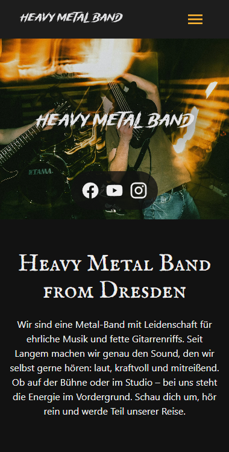
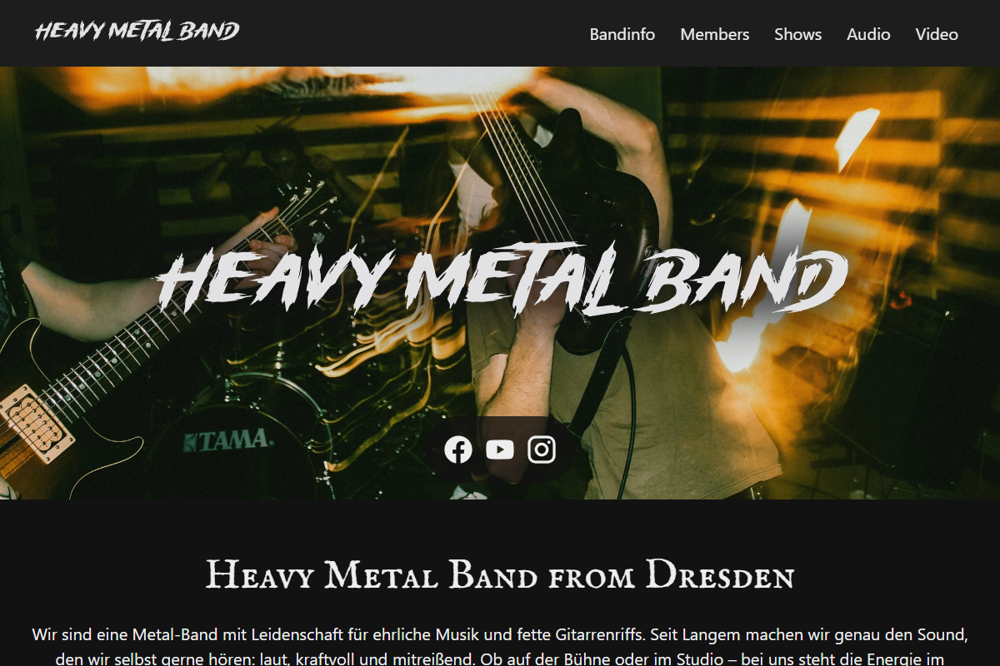

# Heavy Metal Band One-Page Template

> This is a modern, dark-themed one-page HTML/CSS template tailored for heavy metal bands. 
It uses semantic HTML, responsive layouts via CSS Grid and Flexbox, and pure CSS enhancements for animations. 
Minimal JavaScript included for better UX.

## Demo

[View the full demo](https://joergsteinhauer.github.io/website-template-heavy-metal-band/)

## Preview

| Mobile view | Desktop view                        |
|-------------|-------------------------------------|
|      |  |

## Features

- Fully responsive (mobile-first)
- Pure CSS layout (no frameworks)
- Pure CSS animations using `animation-timeline`
- Smooth anchor link scrolling
- Fixed header & mobile menu
- Accessible, semantic, and clean structure
- Minimal JavaScript
- Bandsintown gigs overview embed
- Optional: Cookie Management Platform via cookieyes.com

---

## Folder Structure
```
/
├── index.html
├── css/
│   └── styles.css
├── js/
│   └── nav.js
├── img/
│   └── (your images here)
└── README.md
```

---

## Customization Guide

### 1. Logo

Change the `.logo` image inside `<header>` and `<footer>`. Use SVG.

### 2. Navigation

Change or add navigation items in the `<ul class="wrapper-nav-main">` block in `index.html`.

### 3. Band Images

Replace the `img/band.webp` and member images (`img/member*.webp`) with your own.

### 4. Sections Content

Update the sections: `#bandinfo`, `#members`, `#shows`, `#audio` and `#video` in `index.html` with your own content.

### 5. Colors and Typography

In `css/styles.css`, update the `:root` CSS variables.

You can also change Google Fonts in the `<head>` section of `index.html`.

### 6. Menu Icons

All icons use SVGs from [Pictogrammers MDI](https://pictogrammers.com/library/mdi/). You can swap them or add new ones.

## License

### Code

MIT – feel free to reuse and modify!

### Images

- https://unsplash.com/de/@iam_os
- https://unsplash.com/de/@beccatapert
- https://unsplash.com/de/@gearfilms
- https://unsplash.com/de/@hectorbermudez
- https://unsplash.com/de/@storybyphil
- https://unsplash.com/de/@studiokvr
- https://unsplash.com/de/@ysp_19

## Version

V1.0.1